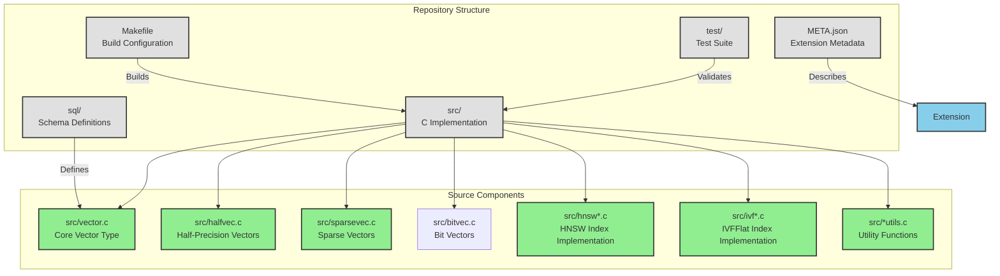
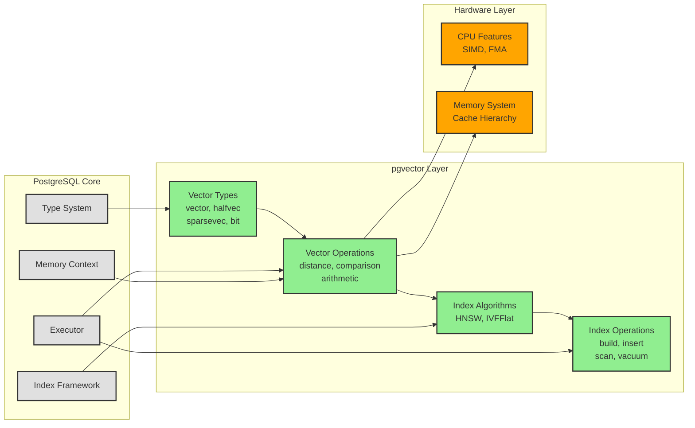
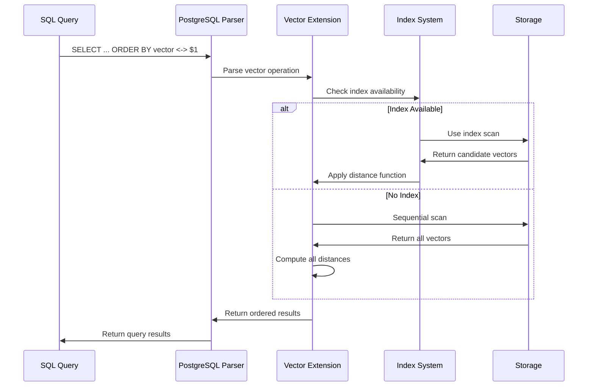
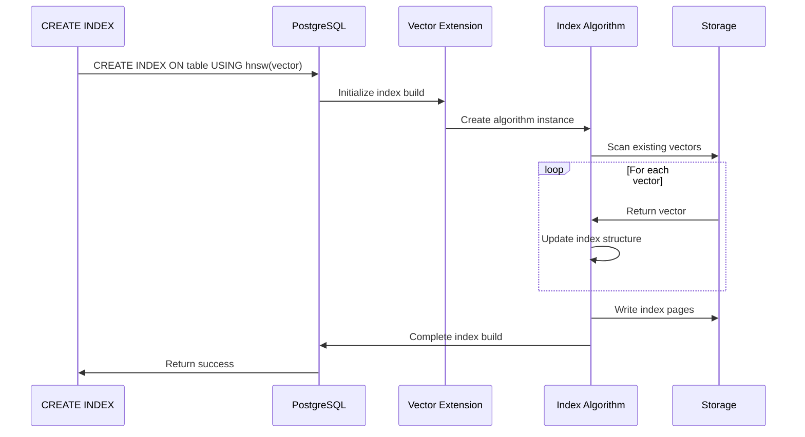
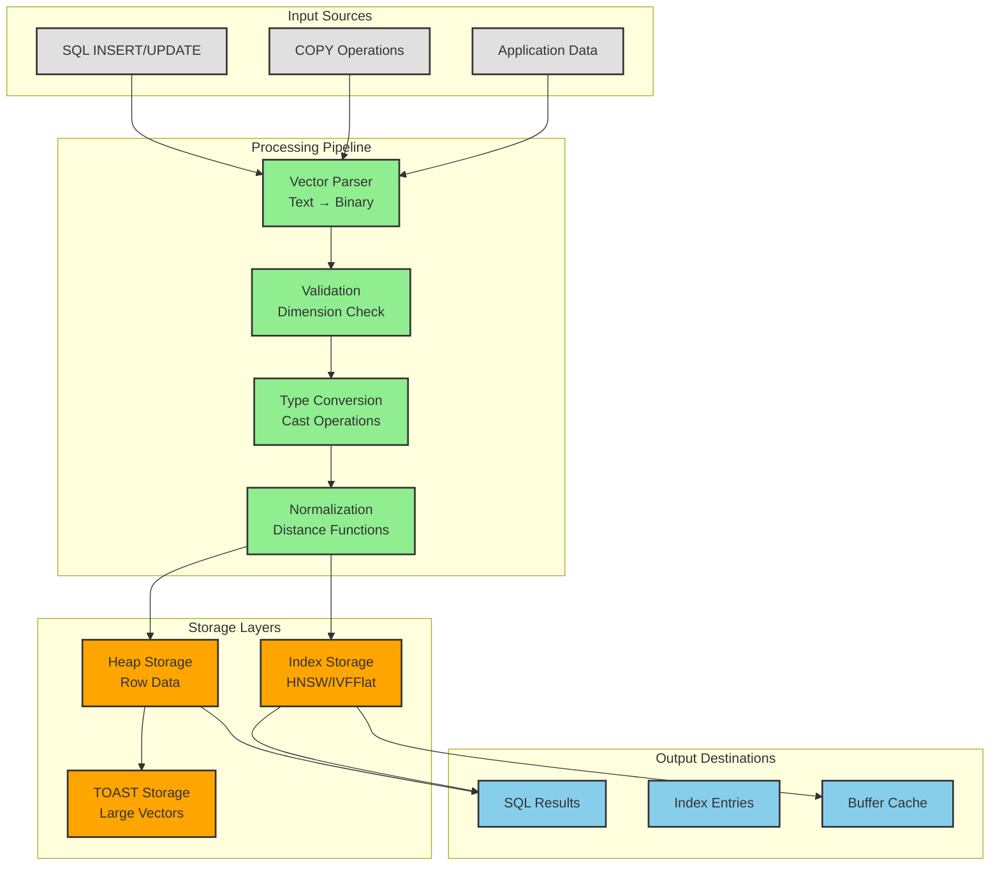
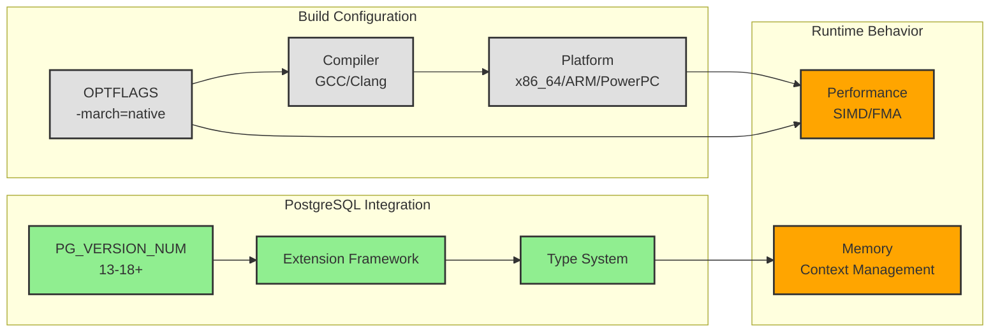
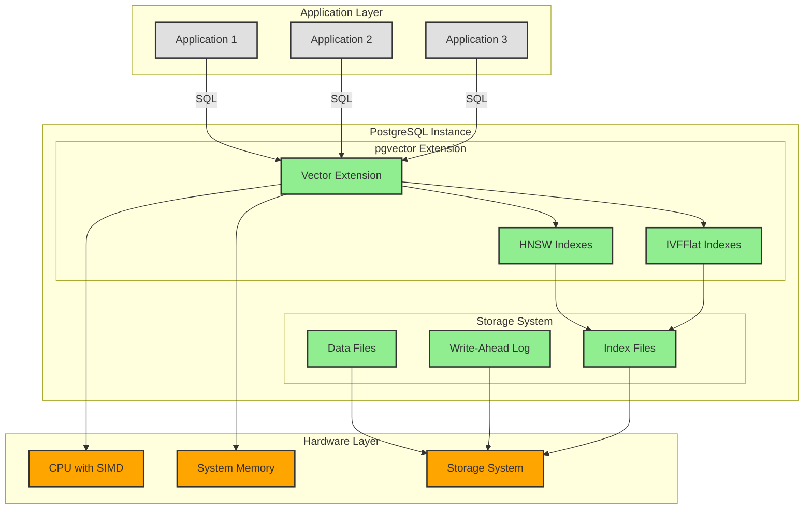

# Architect Project Review — Graphite Style

## 1) System Overview

pgvector is a PostgreSQL extension that implements vector similarity search through a multi-layered architecture combining PostgreSQL's extension framework with specialized vector processing algorithms. The system is structured around distinct vector types, indexing strategies, and distance functions, all integrated into PostgreSQL's type system and query planner.

**Architectural Philosophy:**
- Leverage PostgreSQL's extensibility mechanisms for seamless integration
- Separate concerns between vector representation, operations, and indexing
- Optimize for hardware-specific performance while maintaining portability
- Provide multiple algorithmic approaches for different performance/accuracy tradeoffs

## 2) Repository & Component Map

## 3) Architecture & Dependencies

### Component Dependencies

**Core Vector Types:**
- `vector.c` → `vector.h` (base type definition)
- `halfvec.c` → `halfutils.c` (half-precision utilities)
- `sparsevec.c` → `bitutils.c` (sparse vector utilities)
- `bitvec.c` → `bitutils.c` (bit vector utilities)

**Index Implementations:**
- `hnsw*.c` files form HNSW algorithm cluster
- `ivf*.c` files form IVFFlat algorithm cluster
- Both depend on core vector types for distance calculations

**Utility Layer:**
- `*utils.c` files provide shared functionality
- Hardware-specific optimizations isolated in utility layer

## 4) Execution Flows

### Vector Query Execution Flow

### Index Build Flow

## 5) Data Flow & State Model

### Vector Data Flow

### State Management Model

**Vector State:**
- Stored as PostgreSQL varlena structures with flexible array members
- Memory context managed through PostgreSQL's memory allocation system
- TOAST support for vectors exceeding page size limits

**Index State:**
- HNSW: Graph structure with multi-layer navigation
- IVFFlat: Centroid-based partitioning with inverted lists
- Both use PostgreSQL's buffer management for persistence

**Transaction State:**
- Vector operations participate in PostgreSQL's MVCC
- Index builds create proper WAL records for crash recovery
- Vacuum operations maintain index consistency

## 6) Configuration & Environment Model

### Build-Time Configuration

### Runtime Configuration
- No external configuration files
- Behavior controlled through PostgreSQL GUC variables
- Index parameters specified during CREATE INDEX
- Performance characteristics determined by build-time optimizations

## 7) Deployment & Runtime Topology

## 8) Architectural Risk Observations (All Severities)

### [CRITICAL] None identified

### [HIGH] Memory Management Complexity
**Location:** Throughout C implementation, particularly in vector operations and index builds
**Evidence:** Manual memory allocation using PostgreSQL memory contexts requires careful lifecycle management
**Impact:** Potential memory leaks or corruption affecting database stability
**Concentration:** Vector initialization, index node allocation, temporary computation buffers

### [HIGH] Hardware-Specific Performance Dependencies  
**Location:** Build system and optimization flags
**Evidence:** `-march=native` creates platform-specific binaries with varying performance
**Impact:** Deployment complexity and performance unpredictability across infrastructure
**Concentration:** Distance function implementations, SIMD optimizations, compiler-specific code paths

### [MEDIUM] C Extension Maintenance Burden
**Location:** Entire codebase
**Evidence:** C implementation requires specialized PostgreSQL extension development expertise
**Impact:** Limited developer pool and higher maintenance costs
**Concentration:** Memory management, PostgreSQL API usage, platform-specific code

### [MEDIUM] PostgreSQL Version Coupling
**Location:** Version-specific compilation conditionals
**Evidence:** `#if PG_VERSION_NUM >= 160000` patterns throughout codebase
**Impact:** Ongoing compatibility maintenance required
**Concentration:** Extension loading, function declaration patterns, API usage

### [MEDIUM] Index Algorithm Complexity
**Location:** HNSW and IVFFlat implementations
**Evidence:** Complex graph and partitioning algorithms with concurrent access
**Impact:** Potential race conditions or consistency issues
**Concentration:** Index builds, concurrent inserts, vacuum operations

### [LOW] Platform-Specific Build Complexity
**Location:** Makefile and compiler flags
**Evidence:** Special handling for ARM, PowerPC, and different operating systems
**Impact:** Build system maintenance overhead
**Concentration:** Optimization flag selection, architecture detection

### [LOW] Test Coverage Gaps for Edge Cases
**Location:** Test suite organization
**Evidence:** Separate test files for each component but limited integration testing
**Impact:** Potential undiscovered interaction bugs
**Concentration:** Cross-component interactions, error handling paths

### [LOW] Documentation-Code Synchronization
**Location:** README.md vs. implementation
**Evidence:** Basic documentation may not cover all advanced features
**Impact:** Developer onboarding friction
**Concentration:** Advanced index options, performance tuning parameters

## 9) Diagram Legend & Severity Key

### Diagram Color Conventions
- **Gray (#e0e0e0)**: Repository/External Components
- **Blue (#87CEEB)**: Configuration/Interface Components  
- **Green (#90EE90)**: Core Business Logic
- **Orange (#FFA500)**: Infrastructure/Storage Components

### Severity Tags
- **[CRITICAL]**: Existential system risk
- **[HIGH]**: Serious architectural concern
- **[MEDIUM]**: Material long-term impact
- **[LOW]**: Minor or localized issue

All architectural observations use consistent severity labeling for cross-reference with Executive and Developer views.
