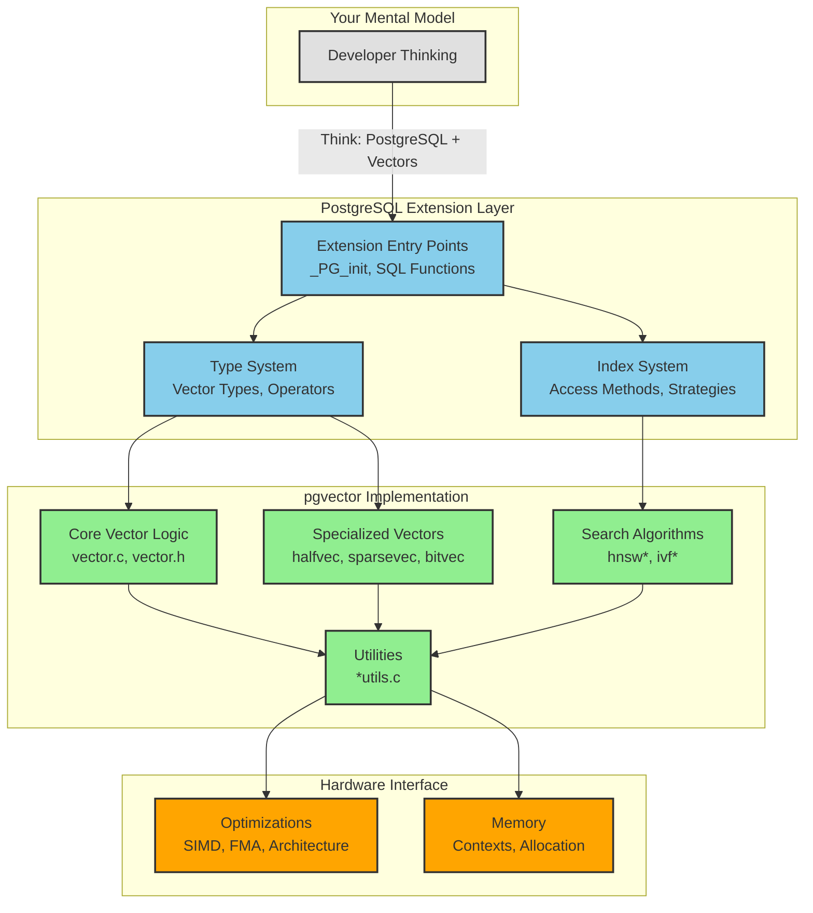
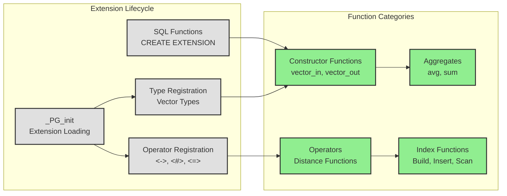
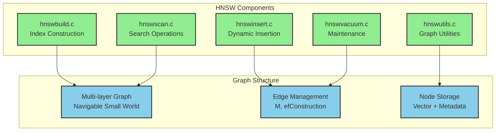
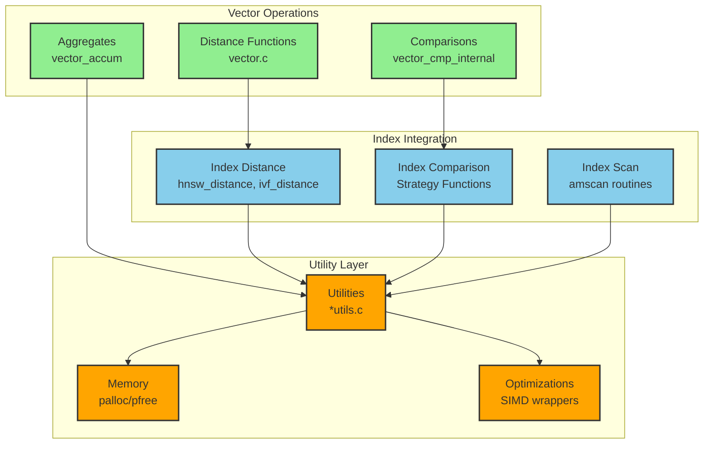
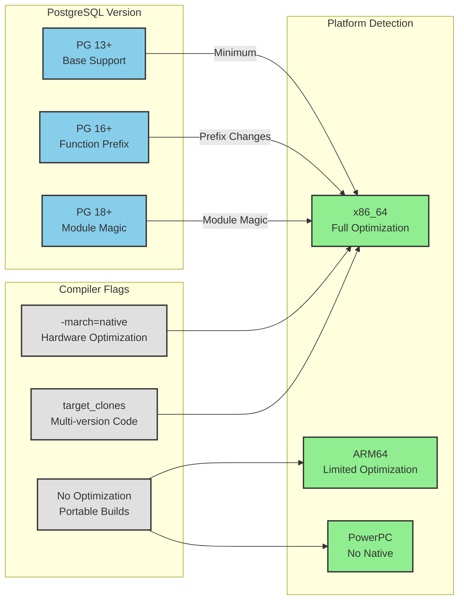

# Developer Project Review — Graphite Style

## 1) How to Think About This System

pgvector is fundamentally a PostgreSQL extension that bridges the gap between PostgreSQL's relational model and vector similarity search. Think of it as adding a new data type family (vectors) with specialized operations (distance functions) and access methods (HNSW/IVFFlat indexes) to PostgreSQL's existing infrastructure.

**Key Mental Models:**
- **Extension Architecture**: pgvector plugs into PostgreSQL's extension framework, not a standalone system
- **Type-Centric Design**: Everything revolves around vector types and their operations
- **Algorithm Library**: HNSW and IVFFlat are algorithms implemented as PostgreSQL access methods
- **Memory Context Awareness**: All allocations happen within PostgreSQL's memory management

**Development Philosophy:**
- Leverage PostgreSQL's existing infrastructure (types, indexes, memory, transactions)
- Implement vector operations as PostgreSQL functions and operators
- Use PostgreSQL's buffer management for persistence and concurrency
- Optimize for hardware while maintaining portability through compile-time flags

## 2) Codebase Mental Model



## 3) Entry Points & Lifecycles

### Extension Entry Points


### Key Function Signatures
**Vector Input/Output:**
```c
Vector *vector_in(PG_FUNCTION_ARGS);      // Text → Vector
Datum vector_out(PG_FUNCTION_ARGS);       // Vector → Text
```

**Distance Functions:**
```c
float vector_l2_squared_distance(Vector *a, Vector *b);
float vector_inner_product_distance(Vector *a, Vector *b);
float vector_cosine_distance(Vector *a, Vector *b);
```

**Index Operations:**
```c
IndexBuildResult *hnswbuild(Relation heap, Relation index, IndexInfo *indexInfo);
void hnswinsert(Relation index, Datum *values, bool *isnull, ItemPointer heap_tid,
                Relation heap, IndexUniqueCheck checkUnique, bool indexUnchanged);
```

## 4) Key Modules Explained

### Core Vector Module (`vector.c`)
**Purpose**: Implements the basic vector type and core operations
**Key Functions**:
- `InitVector()`: Allocates and initializes vector structures
- Distance calculations (L2, inner product, cosine)
- Comparison functions for sorting
- Aggregate support (avg, sum)

**Memory Pattern**: Uses PostgreSQL's palloc() within current memory context

### Specialized Vector Types
**Half-Precision (`halfvec.c`)**:
- 16-bit floating point vectors for memory efficiency
- Conversion utilities in `halfutils.c`
- Same operations as regular vectors with precision tradeoff

**Sparse Vectors (`sparsevec.c`)**:
- Efficient storage for high-dimensional sparse data
- Custom distance calculations optimized for sparsity
- Index support through specialized operators

**Bit Vectors (`bitvec.c`)**:
- Binary vector representation
- Hamming distance and Jaccard similarity
- Compact storage using bit manipulation

### Index Algorithms

#### HNSW Implementation (`hnsw*.c` files)


#### IVFFlat Implementation (`ivf*.c` files)
- Centroid-based clustering for vector partitioning
- Inverted lists for efficient search
- K-means clustering for centroid computation

## 5) Module Interactions & Dependencies

### Vector Operation Dependencies


### Critical Interaction Patterns

**Vector → Index Flow**:
1. Vector operations provide distance functions
2. Index algorithms use distance functions for search
3. Both share utility functions for memory and optimization

**Memory Context Flow**:
1. PostgreSQL calls extension functions
2. Extensions allocate memory in current context
3. Memory automatically freed when context ends
4. No manual memory management needed in most cases

## 6) Configuration & Runtime Behavior

### Build-Time Configuration


### Runtime Behavior Patterns

**Memory Allocation**:
```c
// Always use PostgreSQL memory contexts
Vector *result = (Vector *) palloc0(VECTOR_SIZE(dim));
// Never use malloc/free directly
```

**Error Handling**:
```c
// Use PostgreSQL error reporting
erereport(ERROR,
    (errcode(ERRCODE_DATA_EXCEPTION),
     errmsg("vector dimension %d exceeds maximum %d", dim, VECTOR_MAX_DIM)));
```

**Function Declaration**:
```c
// Version-aware function prefixing
#if PG_VERSION_NUM >= 160000
#define FUNCTION_PREFIX
#else
#define FUNCTION_PREFIX PGDLLEXPORT
#endif
```

## 7) Developer Guidelines & Pitfalls

### Where to Add Code

**New Vector Operations**:
- Add to `vector.c` for core operations
- Update `vector.h` for function declarations
- Add SQL functions to extension script

**New Index Algorithms**:
- Create new file cluster (algorithm*.c)
- Implement PostgreSQL access method interface
- Follow existing patterns from HNSW/IVFFlat

**New Vector Types**:
- Create type-specific files (newtypevec.c)
- Implement type conversion functions
- Add distance function implementations

### Where NOT to Add Code

**Don't Modify Core PostgreSQL**: pgvector is an extension, not a PostgreSQL fork
**Don't Use Standard C Memory**: Always use PostgreSQL memory contexts
**Don't Assume Hardware**: Use compile-time detection, not runtime
**Don't Skip Error Handling**: All user input needs validation

### Common Pitfalls

**Memory Management**:
```c
// WRONG: Never do this
Vector *v = malloc(sizeof(Vector));

// RIGHT: Always use palloc
Vector *v = (Vector *) palloc(VECTOR_SIZE(dim));
```

**Function Prefixing**:
```c
// WRONG: Missing prefix
Datum my_function(PG_FUNCTION_ARGS) { ... }

// RIGHT: Use prefix macro
FUNCTION_PREFIX
Datum my_function(PG_FUNCTION_ARGS) { ... }
```

**Version Compatibility**:
```c
// WRONG: Assuming specific PostgreSQL version
#if PG_VERSION_NUM >= 150000

// RIGHT: Check actual feature availability
#ifdef SOME_FEATURE_MACRO
```

## 8) Suggested Reading Order

### For New Contributors
1. **Start Here**: `README.md` - Project overview and basic usage
2. **Core Concepts**: `src/vector.h` - Vector structure and basic definitions
3. **Type Implementation**: `src/vector.c` - Core vector operations
4. **SQL Interface**: `sql/vector.sql` - How vectors appear to users
5. **Test Examples**: `test/sql/vector_type.sql` - Usage patterns

### For Algorithm Development
1. **Index Interface**: Study existing index implementations
2. **HNSW Algorithm**: `src/hnsw*.c` - Graph-based search
3. **IVFFlat Algorithm**: `src/ivf*.c` - Centroid-based search
4. **Access Methods**: PostgreSQL documentation on index AM interface

### For Performance Optimization
1. **Utility Functions**: `src/*utils.c` - Optimization patterns
2. **Build System**: `Makefile` - Compiler flag selection
3. **Hardware Detection**: Platform-specific optimizations
4. **Distance Functions**: Vectorized implementations

## 9) Glossary

**AM (Access Method)**: PostgreSQL's interface for index types
**GUC (Grand Unified Configuration)**: PostgreSQL configuration parameter
**HNSW**: Hierarchical Navigable Small World (graph-based index)
**IVFFlat**: Inverted File with Flat compression (centroid-based index)
**L2 Distance**: Euclidean distance between vectors
**TOAST**: PostgreSQL's mechanism for large data storage
**Varlena**: PostgreSQL's variable-length data type format
**WAL**: Write-Ahead Log for crash recovery

## 10) Diagram Legend & Severity Key

### Diagram Color Conventions
- **Gray (#e0e0e0)**: Mental models / External concepts
- **Blue (#87CEEB)**: PostgreSQL interfaces / Configuration
- **Green (#90EE90)**: Implementation components / Code
- **Orange (#FFA500)**: Hardware / Infrastructure

### Severity Tags (for cross-reference)
- **[CRITICAL]**: Code that could crash the database
- **[HIGH]**: Complex code requiring careful review
- **[MEDIUM]**: Areas needing ongoing attention
- **[LOW]**: Minor optimization opportunities

This developer view aligns with the Executive and Architect views, providing code-level context for the architectural decisions and risk observations documented in those perspectives.
