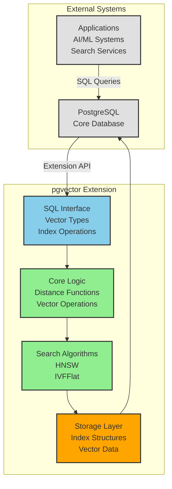

# Executive Project Review — Graphite Style

## 1) Executive Summary

pgvector represents a strategic PostgreSQL extension that transforms PostgreSQL into a vector database capable of high-performance similarity search. The system demonstrates solid architectural foundations with moderate complexity and manageable risk profile. Key business considerations include hardware-specific performance optimization dependencies and the inherent complexity of C-based PostgreSQL extensions requiring specialized maintenance expertise.

The project shows strong engineering discipline with comprehensive test coverage and clear separation of concerns between vector types, indexing algorithms, and distance functions. However, the C implementation creates long-term maintenance overhead and limits developer pool availability compared to modern alternatives.

## 2) System Overview

pgvector extends PostgreSQL with native vector similarity search capabilities, supporting multiple vector precisions and both exact and approximate search algorithms. The system processes vector data through PostgreSQL's type system, enabling SQL-based vector operations with performance optimizations for modern hardware.

**Core Value Proposition:**
- Enables PostgreSQL to function as a vector database without external dependencies
- Provides production-ready approximate search algorithms (HNSW, IVFFlat)
- Maintains ACID properties through PostgreSQL's transaction system
- Supports multiple vector types for different use cases and memory requirements

## 3) High-Level Architecture

## 4) External Dependencies & Exposure

**PostgreSQL Version Dependencies:**
- Minimum PostgreSQL 13.0 required
- Version-specific compilation flags for PostgreSQL 16+ and 18+
- Tight coupling to PostgreSQL's extension mechanism and type system

**Hardware Dependencies:**
- Performance optimizations use `-march=native` compilation flags
- ARM64 architecture requires special handling (Mac ARM)
- PowerPC architecture lacks native optimization support
- Auto-vectorization capabilities vary by CPU architecture

**Build System Dependencies:**
- PostgreSQL development headers and extension build infrastructure
- Platform-specific compiler optimizations
- No external runtime dependencies beyond PostgreSQL

## 5) Critical & High Risk Areas

### [HIGH] Memory Management Complexity
The C implementation requires manual memory management within PostgreSQL's memory contexts. Vector operations involve dynamic allocation with potential for memory leaks or corruption if not properly handled within PostgreSQL's memory lifecycle.

**Risk Concentration:**
- Vector data structure initialization and cleanup
- Index build operations with large datasets
- Search operations creating temporary data structures

### [HIGH] Hardware-Specific Performance Dependencies
System performance heavily depends on compiler optimizations (`-march=native`) that create platform-specific binaries. This creates deployment complexity and potential performance variations across different infrastructure.

**Risk Concentration:**
- Production deployments may not match development performance
- Cloud deployments require careful instance selection for optimal performance
- Cross-platform compatibility requires specialized build processes

## 6) System Complexity & Maturity

**Complexity Assessment: MODERATE-HIGH**

The system exhibits moderate to high complexity due to:
- C implementation requiring PostgreSQL extension development expertise
- Multiple vector types with distinct memory layouts and operations
- Sophisticated indexing algorithms (HNSW, IVFFlat) with complex state management
- Hardware-specific optimization requirements

**Maturity Indicators:**
- Comprehensive test suite covering all major functionality
- Clear architectural separation between vector types and indexing algorithms
- Production-ready version (0.8.1) with established user base
- Well-documented SQL interface and extension mechanisms

**Technical Debt Level: MODERATE**
- C implementation creates ongoing maintenance burden
- Hardware-specific optimizations limit portability
- Manual memory management requires specialized expertise

## 7) Strategic Observations

**Strengths:**
- First-class PostgreSQL integration maintains ACID properties
- No external dependencies reduces operational complexity
- Comprehensive vector type support enables diverse use cases
- Established production deployments demonstrate viability

**Strategic Considerations:**
- C implementation limits developer talent pool and increases maintenance costs
- Hardware optimization dependencies create deployment complexity
- PostgreSQL version coupling requires ongoing compatibility maintenance
- Extension architecture limits scalability compared to dedicated vector databases

**Long-term Viability:**
The system demonstrates solid engineering foundations with manageable risk profile. The primary strategic consideration involves the long-term maintenance burden of C implementation versus potential modernization benefits. The established user base and production deployments indicate strong market fit, while the architectural design supports continued feature development within PostgreSQL's extension framework.
