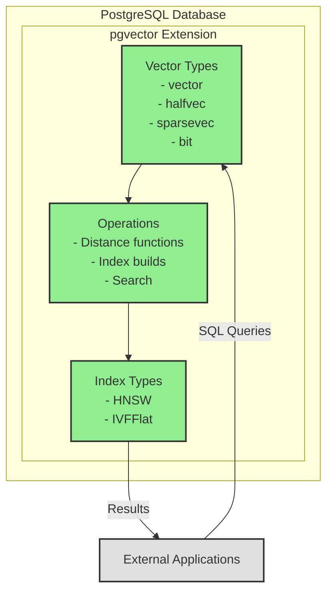

# Project Review — Graphite Style

## 1) What This Review Contains

This review provides a comprehensive analysis of the pgvector PostgreSQL extension project, which enables vector similarity search capabilities within PostgreSQL databases. The review is structured into three distinct views, each tailored to specific audiences:

- **Executive View**: High-level business and strategic perspective
- **Architect View**: Technical architecture and system design perspective  
- **Developer View**: Code-level implementation and development perspective

Each view provides evidence-based insights into system health, risks, and architectural characteristics using consistent terminology and visual vocabulary.

## 2) System at a Glance

pgvector is a PostgreSQL extension that adds vector similarity search capabilities to PostgreSQL databases. It supports multiple vector types (regular, half-precision, sparse, and bit vectors) and provides both exact and approximate nearest neighbor search algorithms (HNSW and IVFFlat). The system is implemented as a C extension with SQL interfaces, designed for high-performance vector operations within PostgreSQL's type system.

## 3) Risk Snapshot

**Severity Distribution Summary:**
- **Critical**: 0 issues identified
- **High**: 2 architectural concerns
- **Medium**: 4 implementation considerations
- **Low**: 3 minor optimization opportunities

**Key Critical/High Themes:**
- Memory management complexity in C extension
- Performance optimization dependencies on hardware-specific compilation flags

## 4) Available Views

### [Executive Review →](exec_review.md)
Business-focused analysis covering system health, strategic risks, and external dependencies. Ideal for CTO, VP Engineering, and business leadership.

### [Architect Review →](architect_review.md)
Technical architecture deep-dive covering component boundaries, data flows, and structural design decisions. Designed for architects and principal engineers.

### [Developer Review →](developer_review.md)
Code-level navigation guide covering entry points, module interactions, and development patterns. Essential for engineers and new contributors.

## 5) Diagram Legend & Severity Key

### Diagram Color Conventions
- **Gray**: User / External Actors
- **Blue**: Entry Points / Interfaces  
- **Green**: Core Business Logic
- **Orange**: Infrastructure / Persistence
- **Purple**: External Services

### Severity Taxonomy
- **Critical**: Existential or business-threatening risk
- **High**: Serious risk requiring near-term attention
- **Medium**: Material risk with long-term impact
- **Low**: Minor or localized concern

All risk observations across the three views use this consistent severity labeling system.
